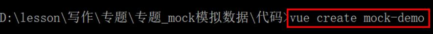
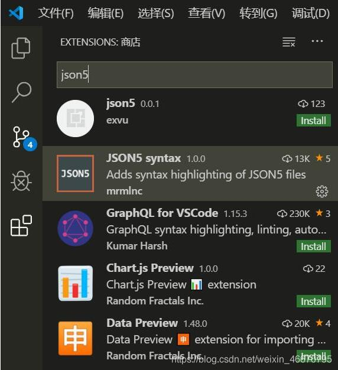
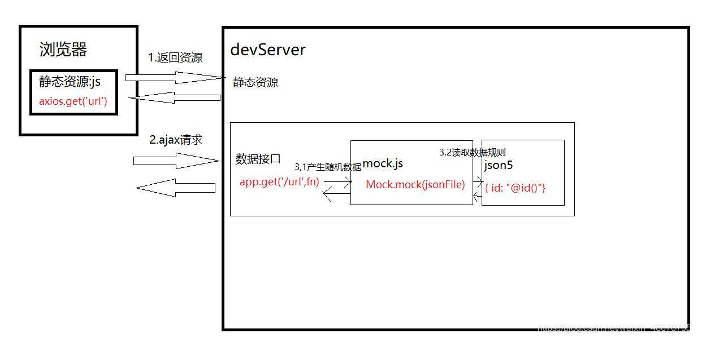

# mock在vue里怎么用？

[https://github.com/nuysoft/Mock/wiki/Getting-Started](https://github.com/nuysoft/Mock/wiki/Getting-Started)
以上是官方文档，不知道mock是什么的自行查看

# 一、下载node.js 的npm 自行下载

~~~ js
+ npm install -g cnpm --registry=https://registry.npm.taobao.org
     //npm的镜像
  + npm install -g @vue/cli    //安装全局脚手架  
      自己新建一个文件夹，并在文件夹中打开  powershell 
  + vue create mypro(文件名可随意换)   //创建并下载一个文件夹
  + npm install vue-router --save //启路由的插件
    --save 代表局部
  + cd mypro
  + npm run serve //运行 
  + 用local 地址打开
~~~

## 1.1 创建项目

~~~ js
vue create mock-demo 
~~~

## 1.2 安装依赖 （不懂请看上面）

vue环境搭建好后，开始安装 mock依赖

~~~ js
     //使用axios发送  ajax
    cnpm install axios --save
  //使用mockjs产生随机数据
    cnpm install mockjs --save-dev
  //使用json5解决json文件,无法添加注释问题
    cnpm install json5 --save-dev
~~~

# 二、学习MOCKJS

新建mock文件夹,新建testMockjs.js

~~~ js
const Mock = require('mockjs');//mockjs 导入依赖模块
var id = Mock.mock('@id')//得到随机的id,字符串
console.log(Mock.mock('@id'), typeof id)

var obj = Mock.mock({
    id: "@id()",//得到随机的id,对象
    username: "@cname()",//随机生成中文名字
    date: "@date()",//随机生成日期
    avatar: "@image('200x200','red','#fff','avatar')",//生成图片,参数:size, background, foreground, text
    description: "@paragraph()",//描述
    ip: "@ip()",//IP地址
    email: "@email()"//email
})
console.log(obj)
~~~

# 三、学习JSON5

json文件,中如果说存在注释文件和编辑器都会报错,我们采用json5格式来让json格式可以存在注释

## 3.1编辑器安装JSON5扩展

## 3.2引入JSON5库来解析JSON5格式

~~~ js
const fs = require('fs');
const path = require('path');
const JSON5 = require('json5');
//读取json文件
function getJsonFile(filePath) {
    //读取指定json文件
    var json = fs.readFileSync(path.resolve(__dirname,filePath), 'utf-8');
    //解析并返回
    return JSON5.parse(json);
}
var json = getJsonFile('./userInfo.json5');
console.log('json', json) 
~~~

# 四、MOCK和VUE-CLI结合

## 4.1新建INDEX.JS

在mock文件夹下,新建index.js

~~~ js
const fs = require('fs');
const path = require('path');
const Mock = require('mockjs');//mockjs 导入依赖模块
const JSON5 = require('json5');
//读取json文件
function getJsonFile(filePath) {
    //读取指定json文件
    var json = fs.readFileSync(path.resolve(__dirname,filePath), 'utf-8');
    //解析并返回
    return JSON5.parse(json);
}

//返回一个函数
module.exports = function(app){
    //监听http请求
    app.get('/user/userinfo', function (rep, res) {
        //每次响应请求时读取mock data的json文件
        //getJsonFile方法定义了如何读取json文件并解析成数据对象
        var json = getJsonFile('./userInfo.json5');
        //将json传入 Mock.mock 方法中，生成的数据返回给浏览器
        res.json(Mock.mock(json));
    });
}
~~~

## 4.2 新建VUE.CONFIG.JS

在项目根目录下,新建vue.config.js

~~~ js
module.exports = {
    devServer: {
        before: require('./mock/index.js')//引入mock/index.js
    }
}
~~~

## 4.3 发送AJAX请求

在src\components\HelloWorld.vue中发送ajax请求

~~~ js
import axios from 'axios'
export default {
  name: 'HelloWorld',
  props: {
    msg: String
  },
  mounted() {
    axios.get('/user/userinfo')
    .then(res => {
      console.log(res)
    })
    .catch(err => {
      console.error(err); 
    })
  }
} 
~~~

# 五、移除MOCK （连接实际api）

在项目根路径新建.env.development

~~~ js
MOCK=true 
~~~

完善mock\index.js

~~~ js
module.exports = function(app){
    if(process.env.MOCK == 'true'){
        //监听http请求
        app.get('/user/userinfo', function (rep, res) {
            //每次响应请求时读取mock data的json文件
            //getJsonFile方法定义了如何读取json文件并解析成数据对象
            var json = getJsonFile('./userInfo.json5');
            //将json传入 Mock.mock 方法中，生成的数据返回给浏览器
            res.json(Mock.mock(json));
        });
    }
} 
~~~

# 六、总结,MOCK-JSON5-DEVSERVER-AXIOS职责

# 七、mockjs 中常用的函数

'Boolean': '@boolean', // 随机生成布尔类型
'Natural': '@natural(1, 100)', // 随机生成1到100之间自然数
'Integer': '@integer(1, 100)', // 生成1到100之间的整数
'Float': '@float(0, 100, 0, 5)', // 生成0到100之间的浮点数,小数点后尾数为0到5位
'Character': '@character("aeiou")', // 在aeiou中，生成随机字符，不传参表示生成随机字符
'String': '@string( 2, 10)', // 生成2到10个字符之间的字符串
'Range': '@range(0, 10, 2)', // 生成一个数组，数组元素从0开始到10结束，间隔为2
'Date': '@date("yyyy yy y MM M dd d")', // 生成一个随机日期,可加参数定义日期格式，默认yyyy-mm-dd
'Color1': '@color', // 生成一个颜色16进制随机值
'Color2': '@rgb', //生成一个颜色rgb随机值
'Paragraph':'@paragraph(2, 5)', //生成2至5个句子的文本
'Sentence':'@sentence(3, 5)', //生成3至5个单词组成的一个句子
'World':'@word(3, 5)', //生成3-5个字母组成的单词
'title':'@title(3,5)', //生成3-5个单词组成的标题
'cParagraph':'@cparagraph(2, 5)', //生成2至5个句子的中文文本
'cSentence':'@csentence(3, 5)', //生成3至5个词语组成的一个中文句子
'cWorld':'@cword(3, 5)', //生成3-5个字组成的中文词语
'ctitle':'@ctitle(3,5)', //生成3-5个词语组成的中文标题
'Name': '@name', // 生成姓名
'cName': '@cname', // 生成中文姓名
'Url': '@url', // 生成url地址
'Email':'@email',//生成邮箱
'Address': '@county(true)'， // 生成省 市 县组成的地址
'Guid':'@guid()', //生成Guid值
